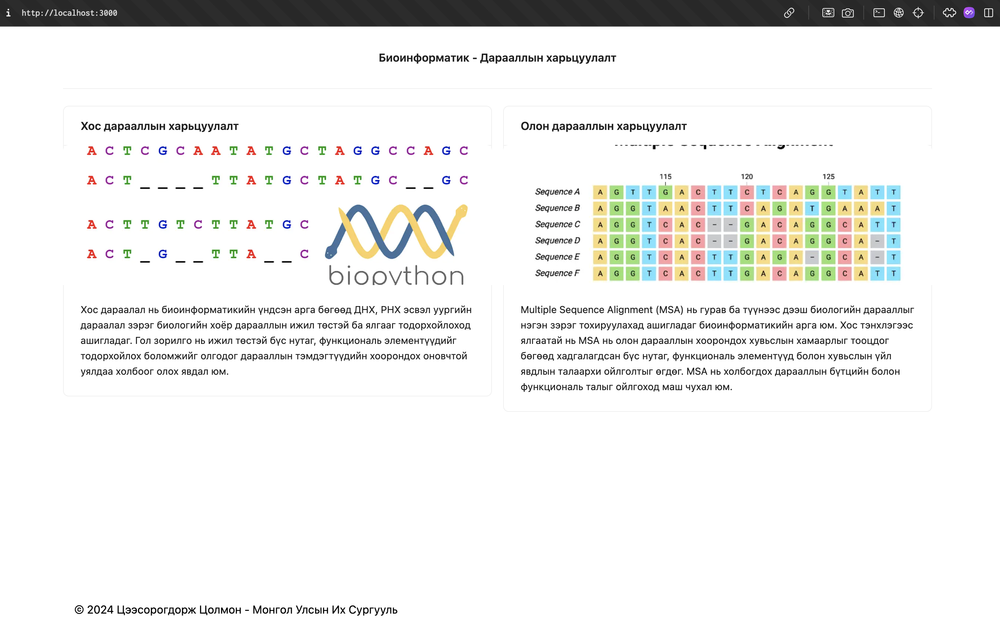

# Bioinformatics Sequence Alignment with Next.js

A modern web-based implementation of bioinformatics sequence alignment algorithms, including **Needleman-Wunsch** and **Smith-Waterman**, built with the Next.js framework.

---

## Table of Contents

- [About the Project](#about-the-project)
- [Features](#features)
- [Technologies Used](#technologies-used)
- [Setup and Installation](#setup-and-installation)
- [Screenshots](#screenshots)

---

## About the Project

This project demonstrates the power of web-based tools in bioinformatics. Using Next.js, this application provides an intuitive interface to perform and visualize sequence alignment using Needleman-Wunsch and Smith-Waterman algorithms.

---

## Features

- **Needleman-Wunsch Algorithm**: Global sequence alignment.
- **Smith-Waterman Algorithm**: Local sequence alignment.
- Interactive interface for inputting sequences.
- Visualization of alignment results, including scoring matrices and alignment steps.
- Responsive and modern UI.

---

## Technologies Used

- **Next.js**: Framework for server-rendered React applications.
- **React**: Frontend library for building the user interface.
- **TailwindCSS**: For modern, responsive UI styling.
- **JavaScript/TypeScript**: Logic and algorithm implementation.

---

## Setup and Installation

1. **Clone the Repository**:
   ```bash
   https://github.com/tsoomo446/bioinformatic.git
   ```
2. **Move to the directory**:
   ```bash
   cd bioinformatic
   ```
3. **Install Dependencies**:
   ```bash
   npm install
   ```
4. **Run nextjs project**:
   ```bash
   npm run dev
   ```

## Screenshots



